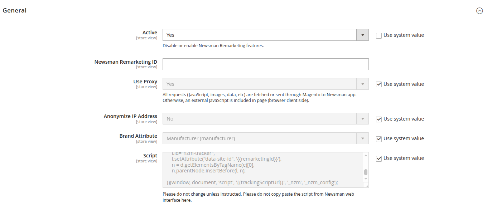

# Magento2 Newsman

[NewsMAN](https://www.newsman.com) Plugin for Magento 2. Sync Your Magento Customers and Subscribers with the NewsMAN Lists and Segments

Simplify the connection between your shop and NewsMAN platform using this straightforward method. Generate an API KEY within your NewsMAN account, install the plugin, and effortlessly synchronize your shop customers and newsletter subscribers with NewsMANlists and segments. The installation process is quick and user-friendly.

# Compatibility

| Magento Version | Extension version           |
|-----------------|-----------------------------|
| 2.4.0 to  2.4.3 | 2.3.0 - 2.3.x               |
| 2.4.4           | 2.4.0 < 2.4.100 (excluding) |
| 2.4.5 to 2.4.6  | 2.4.100 < 2.5.0 (excluding) |
| 2.4.7 to 2.4.8  | 2.5.0 - 2.5.x               |


# Installation with Composer

```
composer require newsman/magento2x
php bin/magento module:enable Dazoot_Newsman Dazoot_Newsmanmarketing
php bin/magento setup:upgrade
php bin/magento cache:clean
```

If Magento is in production mode than compile it again
```
php bin/magento deploy:mode:set production
```

# Configuration

1. Go to **Admin > Stores > Configuration > NEWSMAN > General > General**
   
   
   - Activate the module
   - Set "Send User IP Address" to yes. If not, please set the Magento server IP address. The IP address is used in Newsman API operations.
   - Set "Server IP Address". Set your Magento server IP address if you know it or use your preferred website to find it like https://who.is/.
   - Export Order After Date is set by default with minus 2 years. You can choose a date that you prefer.
2. Go to **Admin >Stores > Configuration > NEWSMAN > General > API**
   

    - Fill in your [Newsman](https://newsman.app/) User ID and API KEY and click the **Save Config** button.
    - Click on "Synchronize Lists and Segments" button to fetch the lists and segments from Newsman.
    - Select the List ID from the dropdown.
    - Click the **Save Config** button again.
    - [optional] Click on button "Export Newsletter Subscribers" to send all subscribed newsletter emails in Magento to Newsman.
      
      If you have a multistore configuration with multiple Newsman List IDs than **do not click** the button yet. Finish all admin stores configurations regarding this extension.
      The extension will sends subscribers to corresponding Newsman lists by store.
      
      Clicking on the button creates a message queue that is processed in background by Magento server.
      See Admin > System > Actions Log > Bulk Actions to see when it finished.
3. Go to **Admin >Stores > Configuration > NEWSMAN > General > Export**

   The authorization used to export data from Magento into Newsman APP: 
    - Set Authorization Header Name. The configuration has to be the same as in Newsman App > E-Commerce > Coupons > Authorisation Header name, Newsman App > E-Commerce > Feed > a feed > Header Authorization, etc.
    - Set Authorization Header Key. The configuration has to be the same as in Newsman App > E-Commerce > Coupons > Authorisation Header value, Newsman App > E-Commerce > Feed > a feed > Header Authorization, etc.
   
    The URL (Webhook URL) in Magento is https://example.com/newsman/.
    In Newsman App > E-Commerce > Feeds > edit a feed, please select the type of file "NewsMAN API".
4. Go to **Admin >Stores > Configuration > NEWSMAN > Remarketing > General**
   
   - Please paste your Newsman Remarketing ID from [Newsman](https://newsman.app/) and set it in this section.

## Webhooks

Configure WebHook URL in [Newsman](https://newsman.app/) in Settings > List > WebHook URL.
The webhook URL is `newsman/` relatively to Magento store's base secure URL. Example: `https://example.com/newsman/` or `https://example.com/[store_code]/newsman/` (if the option to add store codes in URL is set in Magento admin).

Further more set in Newsman APP > Settings > List > "Event-uri Webhook", check "Abonari" (Subscribe), "Importuri" (Import), "Dezabonari" (Unsubscribe).

## Useful links:
- Newsman Knowledge Base https://kb.newsman.com/
- Newsman API Knowledge Base https://kb.newsman.com/api/
- Newsman Remarketing JavaScript API Knowledge Base https://kb.newsman.com/remarketing-developer-javascript-api/

## Description

### Subscription Forms & Pop-ups:
- Create visually appealing forms and pop-ups to capture potential leads.
- Incorporate embedded registrations for newsletters or pop-ups triggered by exit intent.
- Maintain consistency in form presentation across different devices for a seamless user experience.
- Integrate forms with automated systems for timely responses and personalized welcome emails.

### Contact Lists & Segments Management:
- Efficiently import and synchronize contact lists from various sources.
- Simplify data management through segmentation strategies based on demographics or behavior.

### Email & SMS Marketing Campaigns:
- Easily send extensive campaigns, newsletters, or promotions to a broad subscriber base.
- Tailor campaigns for individual subscribers, addressing them by name and suggesting relevant products.
- Re-engage subscribers by re-sending campaigns to those who haven't opened the initial email.

### Email & SMS Marketing Automation:
- Automate the delivery of personalized product recommendations, follow-up emails, and strategies for addressing cart abandonment.
- Strategically tackle cart abandonment or showcase related products to encourage completed purchases.
- Collect post-purchase feedback to enhance customer satisfaction.

### Ecommerce Remarketing Strategies:
- Reconnect with subscribers through targeted offers based on past interactions.
- Personalize interactions with exclusive offers or reminders tailored to user behavior or preferences.

### SMTP Transactional Emails:
- Ensure the prompt and reliable delivery of crucial messages, such as order confirmations or shipping notifications, via SMTP.

### Comprehensive Email and SMS Analytics:
- Gain insights into open rates, click-through rates, conversion rates, and overall campaign performance.

Use the NewsMAN plugin for Magento to seamlessly streamline marketing efforts and establish effective connections with the audience.
